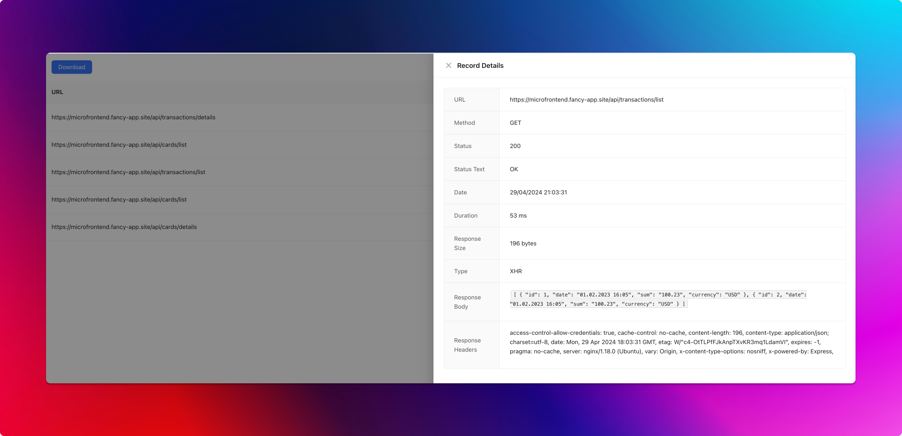

# HTTP Spider

## Description
This project is a Chrome plugin that serves as a tool for creating HTTP mocks for Mocker API. It records HTTP requests made by the user and exports them into mock.js format for easy integration with [Mocker API](https://github.com/jaywcjlove/mocker-api).

## Installation
To install the plugin, follow these steps:
1. Download the latest release from the releases section.
2. Unzip the downloaded file.
3. Open Chrome and go to `chrome://extensions/`.
4. Enable Developer Mode.
5. Click on "Load unpacked" and select the unzipped folder.

## Usage
1. Open the Chrome browser.
2. Navigate to the webpage where you want to create HTTP mocks.
3. Click on the plugin icon in the Chrome toolbar to start recording HTTP requests.
4. Interact with the webpage to trigger different HTTP requests.
5. Click on the plugin icon again to stop recording.
6. Export the recorded HTTP requests to mock.js format for Mocker API integration.

## Example
Below is an example of how to export recorded HTTP requests to mock.js format:
```javascript
// mock.js
module.exports = {
  'GET /api/users': [{ id: 1, name: 'Alice' }, { id: 2, name: 'Bob' }],
  'POST /api/users': { id: 3, name: 'Charlie' }
};
```

## Screenshots


## License
This project is licensed under the MIT License - see the LICENSE.md file for details.

## Contributing
Feel free to contribute to this project by forking it and submitting a pull request. Any contributions are welcome!

## Support
If you encounter any issues or have any questions, please open an issue in the GitHub repository.

---
Feel free to customize this README as needed for your project.
